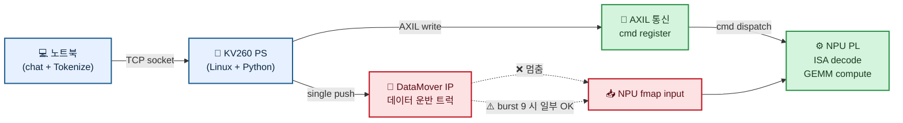
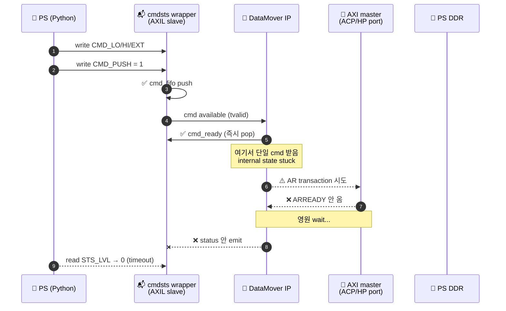
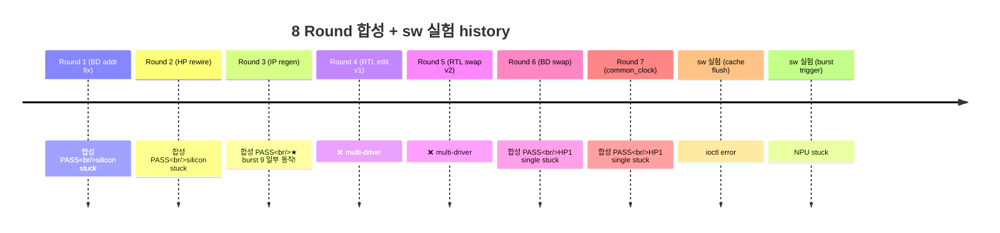
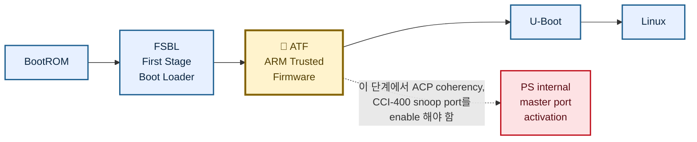
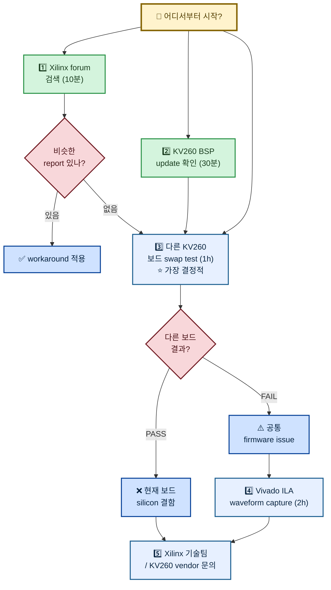

# v002 KV260 문제 — 쉬운 설명

> Current note, 2026-05-31: this simplified explanation is historical. The
> current evidence is in `docs/HANDOFF-v13-cdc-fix-debug-mmio-2026-05-31.md`.
> v13 still reproduces the DataMover status timeout, but the best current
> localization is ACP fmap DataMover command popped, no status, while the NPU
> side is ready for stream input.

**한 줄 요약**: NPU는 잘 만들어졌고 KV260도 잘 돌아가는데, **PS↔PL 사이 데이터 운반 트럭(AXI DataMover)이 silicon에서 single 주문은 못 받음**. 9개 한꺼번에 주문 넣어야 일부 처리.

---

## 그림으로 이해 — 전체 흐름



**범례**:
- 🟢 초록 = silicon에서 잘 동작 (AXIL, NPU compute)
- 🔴 빨강 = silicon에서 멈춤 (DataMover single transfer)
- 🔵 파랑 = 외부 시스템 (host, PS)

## DataMover 안에서 무슨 일이 일어나는지 (single 시)



**핵심**: PS → cmdsts → DataMover까지는 silicon 동작. 단 DataMover → AXI master (S_AXI_ACP/HP_FPD) 사이에서 멈춤.

## 무엇이 안 되는지

**가장 간단한 동작이 안 됨**:

```python
# 1. CMA buffer에 데이터 씀 (4KB)
buf.write(b"hello")

# 2. PS에서 NPU 쪽으로 "이 데이터 4KB 가져가" 명령 1개 보냄
cmdsts_acp_fmap.push(addr=pa, len=4096)

# 3. 결과 기다림
status = cmdsts_acp_fmap.poll_status()  # ← 영원 안 옴 (2초 timeout)
```

**근데 이게 됨** (정말 이상한 부분):

```python
# 같은 명령을 빠르게 9개 연속 push
for _ in range(9):
    cmdsts_acp_fmap.push(...)

# 결과: 6개 응답 옴 (status FIFO에 6 entries)
```

→ **single 주문은 못 받는데 burst 9개는 일부 처리**. silicon 안 DataMover IP의 state machine이 single trigger 안 되는 듯.

---

## 우리가 만든 NPU는 잘 작동


→ **NPU RTL은 잘 만들어졌음**. 문제는 데이터를 NPU에 운반하는 부분 (DataMover IP).

---

## 시도한 fix (8번 합성 = 12시간 GCP)



| # | 시도 | 합성 결과 | silicon 결과 |
|---|---|---|---|
| 1 | cmdsts 주소 매핑 fix | ✅ PASS | ❌ ACP stuck |
| 2 | ACP→HP path BD 라우팅 변경 | ✅ PASS | ❌ ACP stuck |
| 3 | DataMover IP regen | ✅ PASS | ⚠️ burst 9 일부 OK |
| 4 | NPU RTL ACP→HP wire 변경 | ❌ multi-driver | — |
| 5 | RTL swap (2-line) | ❌ multi-driver | — |
| 6 | BD level swap (RTL 안 건드림) | ✅ PASS | ❌ HP1 stuck |
| 7 | mem_BUFFER CDC common_clock | ✅ PASS | ❌ HP1 stuck |
| 8 | sw cache flush ioctl | — | ❌ ioctl error |
| 9 | sw burst trigger (1 real + 8 dummy) | — | ❌ NPU stuck |

**핵심 발견**:
- silicon에서 **single 주문 영원 stuck**
- silicon에서 **burst 9개 일부 OK** (state machine 다른 path)
- ACP path든 HP path든 single 모두 fail
- RTL 변경으로 fix 안 됨 → **silicon HW level 또는 PS firmware level 문제**

---

## 왜 안 되는지 (추정)

### 가장 가능성 높음: KV260 PS firmware 설정



KV260 standard Ubuntu BSP가 이걸 **enable 안 함** (또는 disable 됨). 그래서:
- ACP path (cache coherent) → silicon에서 ARREADY 안 옴 → DataMover stuck
- HP path도 single 시 timing/sync issue (burst만 우연히 trigger)

이건 **Xilinx 또는 Avnet (KV260 vendor) firmware level**. RTL 변경으로 fix 안 됨.

### 그 다음 가능성: AXI DataMover IP의 silicon bug

Xilinx의 axi_datamover 5.1 IP가 KV260 silicon에서 single transfer 시 internal state stuck. 이건 IP를 교체하면 fix 가능 (CDMA, custom RTL master 등).

### 가능 안 함: NPU RTL bug
NPU 자체는 단일 cmd silicon에서 안 받으면 그저 wait. NPU RTL과 무관 (single test는 NPU mem_dispatcher 안 들어가도 fail).

---

## 사용자가 직접 시도 가능한 path (쉬운 순)



### 1️⃣ Xilinx forum / GitHub 검색 (10분)

검색어:
- `"KV260 axi datamover single transfer hang"`
- `"ZynqMP S_AXI_ACP ARREADY stuck"`
- `"KV260 ACP coherency disabled"`
- `"Kria K26 datamover single command"`

비슷한 reports 있으면 → KV260 자체의 알려진 issue + workaround 존재 가능성.

### 2️⃣ KV260 BSP / firmware update 확인 (30분)

Avnet KV260 release notes 확인:
- 최신 BSP version
- ATF/U-Boot update 여부
- "ACP coherency", "cache snoop", "DataMover" 관련 release notes 있는지

만약 KV260에 이미 최신 BSP인데도 안 된다면 H1 (PS firmware level) 가설 강함.

### 3️⃣ 다른 KV260 보드로 같은 bitstream test (1시간)

다른 KV260 보드가 있다면:
- 같은 bitstream + 같은 silicon test 실행
- PASS이면: **현재 KV260 보드 자체의 silicon 또는 firmware 결함**
- FAIL이면: **KV260 모든 보드 공통의 PS port 설정 issue**

가장 결정적 가르마 test.

### 4️⃣ Vivado ILA waveform capture (2시간 + 사용자 GUI 작업)

ILA core BD에 추가해서 silicon에서 직접 wave 잡기. silicon level 정확 cause 진단:
- DataMover cmd port `m_axis_cmd_tready` 신호 — `0` stuck인지
- ACP master `ARREADY` 신호 — silicon에서 정말 안 오는지
- 정확 root cause = silicon에서 무엇이 멈추는지

단 사용자가 Vivado HW Manager + JTAG 케이블 + GUI 작업 필요.

### 5️⃣ 가장 확실 — Xilinx 기술팀 / KV260 vendor 문의

이건 진짜 hardware engineer perspective가 필요. 정리한 evidence:
- "KV260 silicon에서 AXI DataMover IP single transfer status emit 안 함"
- "burst 9 cmds rapid push 시 일부 status emit"
- "ACP/HP path 모두 동일 silicon behavior"
- "NPU RTL 변경 무관 (cmdsts wrapper level direct test에서도 fail)"

→ Xilinx forum 또는 Avnet support에 정확히 이렇게 문의 가능.

---

## 솔직히 말씀드리면

이건 **우리 NPU 설계 문제 아님**. silicon level 또는 KV260 firmware level이라서 RTL 변경으로는 fix 안 됨.

8번 합성 시도 하면서 알게 된 것:
- ✅ NPU는 잘 만들어짐 (AXIL/ISA dispatch 다 silicon 동작)
- ✅ MEMSET 같은 데이터 안 옮기는 명령은 silicon에서 PASS
- ❌ 데이터 옮기는 부분 (DataMover IP)이 silicon level 문제

**가장 빠른 해결책**: Xilinx forum 검색 + KV260 BSP update + 다른 KV260 보드로 비교 test. 이중 하나로 cause 명확해지면 fix path 결정 가능.

---

## 파일 위치 (검증 가능)

작업폴더: `/home/hwkim/Desktop/pccxai-private/v002-kv260-deploy-20260527/`

핵심 파일:
- `V002_PROBLEM_EXPLAINED.md` ← 이 파일 (쉬운 설명)
- `V002_DEBUG_REPORT.md` ← 기술 상세 (Xilinx forum 문의용)
- `AUTONOMOUS-NIGHT-2026-05-28.md` ← 전체 진행 log
- `new-bits/pccx_v002_v8_common_clock.bit.bin` ← 당시 마지막 합성 bitstream (현재는 v13; `docs/README.md` 참고)

KV260 확인:
```bash
ssh ubuntu@192.168.219.108 'ls /dev/uio*; cat /sys/class/uio/uio4/name'
# /dev/uio4 = pccx-npu (NPU AXIL window OK)

ssh ubuntu@192.168.219.108 'sudo md5sum /lib/firmware/xilinx/pccx_npu_bd/pccx_npu_bd.bit.bin'
# e97b1bbcb6ecff4a4c4e11d4d0f2af40 (historical v8 at report time; current v13 is in docs/README.md)
```

GCP Vivado VM:
- `pccx-vivado` (asia-northeast3-a)
- Project: `/home/hwkim/v002-rtl/hw/build/system_bd/pccx_v002_kv260_top.xpr`
